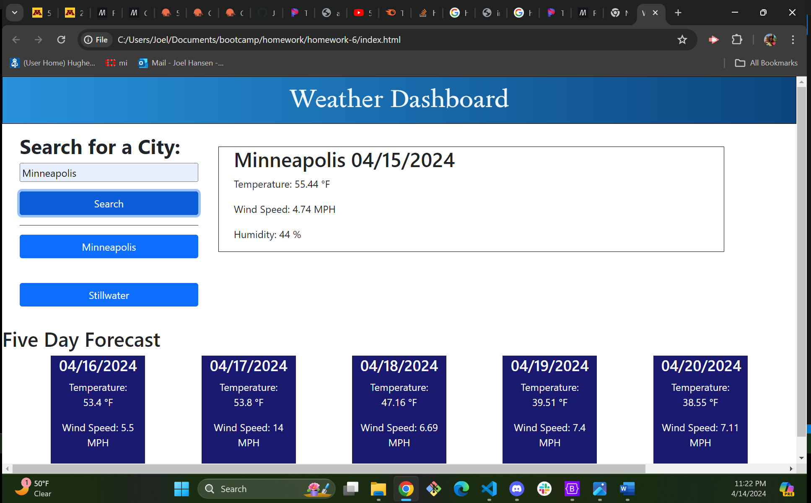

# Weather Forecast Project

## Description
- This project focused on the creation of a weather dashboard application where users can search by city and are provided with a current forecast as well as a five day forecast.  This project uses aspects of bootstrap and features dynamically updated HTML and CSS powered by jQuery. Information for the application uses the [5 Day Weather Forecast](https://openweathermap.org/forecast5) to retrieve weather data for cities.  

This project was completed by Joel Hansen who was provided assistance from cohort classmates, bootcamp tutors and in class notes/lectures.  

## Screenshots

## link to github repo 
[click here](https://github.com/JoelhansenMN/weather-application)

## link to application
[click here](https://joelhansenmn.github.io/weather-application)